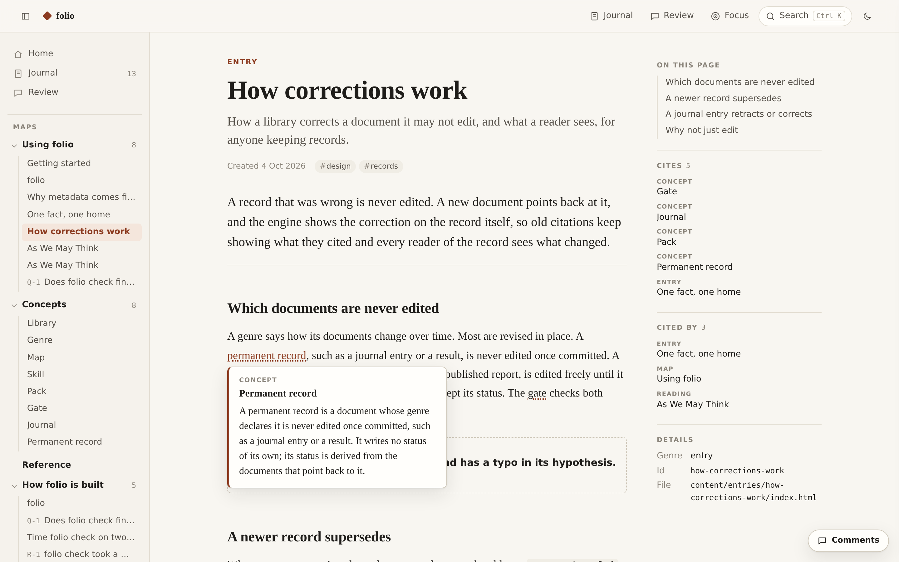

# folio

folio turns your coding agent into the librarian of a knowledge library: fast, good-looking HTML pages and Markdown records that live inside any project (lab notes, study notes, a project's docs) or stand on their own. Every document has one genre, and the genre fixes its job, its reader, its voice, its format and its checks. The genre gives structure and voice, never form: every HTML page is a free canvas, and the agent lays it out for what it must show, with figures, diagrams, interactive controls and math. Documents link to each other like a Zettelkasten, and maps give a reader the way in.

You do not run folio yourself. You install it by handing your agent a setup prompt, and from then on you ask in plain words: "add a concept for X", "tidy the maps", "go through my comments", "build the site". The agent follows folio's seven skills, calls the `folio` command, and runs the gate before every commit. folio is the method and the checks that keep an agent-written library honest and consistent, plus the shell that makes it pleasant to read.

<picture>
  <source media="(prefers-color-scheme: dark)" srcset="docs/assets/figures/how-folio-works-dark.svg">
  
</picture>

## Install

Paste this into your coding agent, in the project where the library should live:

```text
Install folio here: run `uv tool install folio-kb` (or `pipx install folio-kb`), then `folio init`, then read .agents/skills/set-up/SKILL.md and follow it.
```

The agent asks you at most three questions in one message (what the library is for, where it lives, which packs to switch on), creates the library and leaves the gate passing. A longer version of the prompt is in [SETUP.md](SETUP.md). folio needs Python 3.10 or later.

## What a library looks like

A library is a folder with a `folio.yaml`. It can be a project's `docs/`, a notes folder, or a whole repository.

```
docs/
  folio.yaml            the charter: name, purpose, reader, packs, home maps
  content/
    index.html          the home page
    concepts/<slug>/    one folder per genre
    maps/
    journal/2026/       one Markdown file per entry
  assets/               figures, refs.bib, data
  .folio/               generated indices, committed and checked
.agents/skills/         the seven skills, at the project root
```

Each document keeps its facts in metadata and its prose in the body. The shell draws the header and the link panels from the metadata and the generated indices, so nothing is written twice.

<picture>
  <source media="(prefers-color-scheme: dark)" srcset="docs/assets/figures/anatomy-dark.svg">
  
</picture>

Pages are plain HTML in git, readable with no build step. Each page gets the whole room between the library rail and the page panel, and may carry its own style and script; a page that is one line of argument can ask for the reading column instead. `folio serve` shows them locally with search, link previews, concept popovers, light and dark themes, and a comment panel; `folio export` writes a static site.

<picture>
  <source media="(prefers-color-scheme: dark)" srcset="docs/assets/figures/popover-dark.png">
  
</picture>

Hover a link to preview the document it points to; hover a concept to read its definition without leaving the page. Readers can also comment on any rendered page, and the agent answers on the page itself.

## Genres and packs

| Where | Genres | For |
| --- | --- | --- |
| Core | concept, note, entry, map, guide, project, journal, paper, deck | Any library: definitions, ideas, arguments, reading paths, tutorials, the state of some work, the dated record, LaTeX papers with frozen versions, slide decks for a talk. |
| knowledge-base pack | source, reading, survey | Keeping what you read: a verified citation with the original beside it, your close reading of it, and comparisons across works. Workflows: ingest, quiz. |
| lab pack | question, protocol, result, claim, report | Work tested against evidence: ranked questions, protocols locked before they run, one home per measured number, claims, plain-English reports. Workflows: record-a-result, write-a-report. |

A pack is switched on in the charter and rewrites nothing. A library can override a genre, add a variant for a second audience, or add genres, workflows and packs of its own.

## The seven skills

| Skill | Use it to |
| --- | --- |
| set-up | Create a library in a project or a new repository, write its charter, and leave the gate passing. |
| configure | Change the charter: packs, home maps, a genre's limits, a new genre, a variant, a workflow. |
| write | Add or revise any document in its genre's voice, link its concepts, flag only what needs your judgement, put it on a map. |
| organise | Move, merge, promote and retire documents and maps with every link, comment and date intact; run health passes. |
| address | Answer the comments readers left on rendered pages, on the page they were left on. |
| publish | Export the static site; build a paper and freeze versions of it. |
| run | Follow a workflow from a pack or the library, step by step. |

## The gate

```bash
folio check     # every problem in one pass; changes nothing; exit 0 only when there is no error
```

It runs offline, and CI runs the same command. It checks that every link resolves, every document meets its genre's card, no placeholder is left, records that must never change have not changed, nothing is orphaned, one fact keeps one home, and the generated indices are current.

## Learn more

- Documentation: [pierg.github.io/folio](https://pierg.github.io/folio/). It is itself a folio library, kept in [`docs/`](docs/), with a guide, the concepts, and a worked example from each pack.
- The specification: [`docs/spec/`](docs/spec/). [`model.md`](docs/spec/model.md) is the contract the rest builds on; when anything disagrees with it, it wins.
- Contributing: [CONTRIBUTING.md](CONTRIBUTING.md). Changes: [CHANGELOG.md](CHANGELOG.md).

## License

MIT. See [LICENSE](LICENSE).
